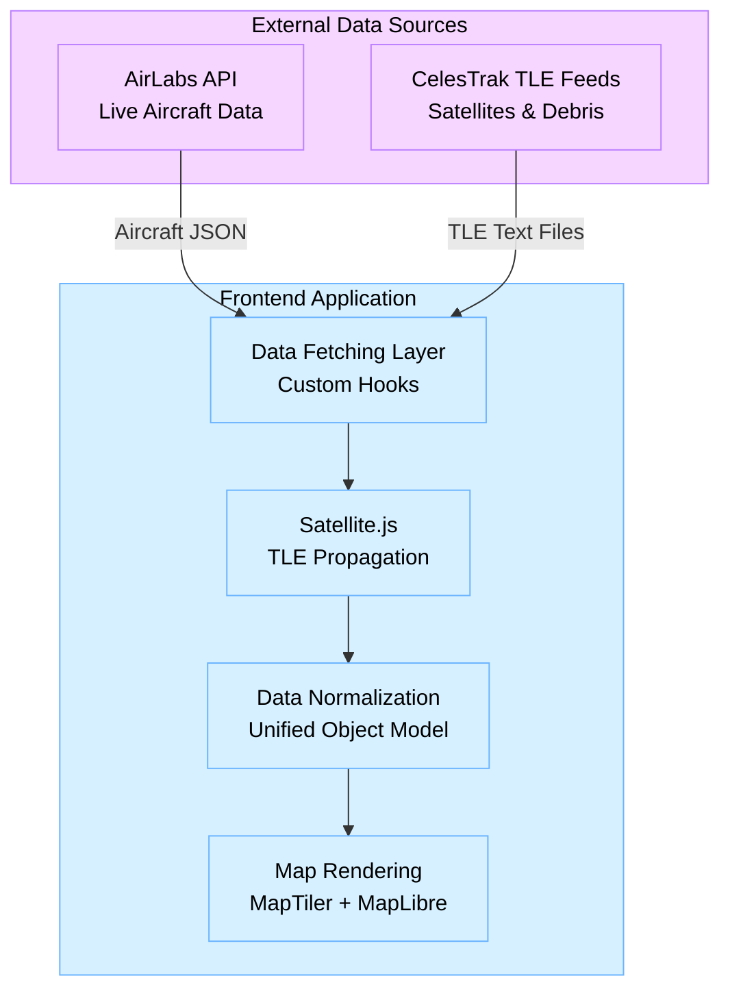

# Flight, Satellite & Debris Live Tracker (POC)
A real-time web-based tracker that visualizes **aircraft**, **satellites**, and **space debris** on an interactive 3D globe.  
This project is a **Proof of Concept (POC)** demonstrating real-time geospatial rendering, TLE propagation, and live API-driven updates using modern frontend technologies.

---

## Overview

This POC showcases how to:
- Fetch **live aircraft data** using AirLabs API  
- Fetch **satellite & debris orbital data** using CelesTrak TLE feeds  
- Convert TLE → real-time lat/lon/alt using `satellite.js`  
- Render dynamic objects on a 3D map using **MapTiler + MapLibre**  
- Implement **real-time movement and periodic updates**  
- Provide a unified UX for tracking aerial & orbital objects

This prototype focuses on clarity, simplicity, and end-to-end integration, not on production scalability.

---

## Technology Stack

**Frontend Framework**
- React 19 + TypeScript  
- Vite for fast development

**Mapping**
- MapTiler SDK  
- MapLibre GL

**APIs**
- **AirLabs API** (Aircraft Data)  
- **CelesTrak TLE feeds** (Satellites & Debris Data)

**Utilities**
- `satellite.js` for orbital propagation  
- Tailwind CSS for UI  
- Custom hooks for live data polling

---

## Data Sources & Design Decisions

### ✈️ Aircraft Data — *AirLabs API*
We selected **AirLabs** (instead of FlightRadar24) because:
- FR24 API is **paid** & not publicly documented  
- AirLabs offers a **free tier** suitable for POC  
- Simple REST endpoints  
- Good global coverage (~500 aircraft visible in POC)

**Tradeoffs**
- AirLabs provides fewer metadata fields than FR24  
- Lower positional refresh frequency  
- Occasional rate limits in free tier

**If FR24 was used**
- Higher refresh rate  
- Richer aircraft metadata (model, manufacturer, vertical speed, etc.)  
- More accurate & dense coverage  
- But requires **paid access** and backend proxying

---

### 🛰️ Satellite & Debris Data — *CelesTrak (TLE)*
We selected **CelesTrak** instead of LeoLabs because:
- LeoLabs is **paid** and API access requires enterprise plans  
- CelesTrak provides **public, free, reliable TLE datasets**  
- Perfect for TLE-based orbit propagation  
- Works well for POC scale (100–150 satellites)

**Tradeoffs**
- TLEs are updated every ~12–24 hours  
- Real-time positional accuracy is lower compared to LeoLabs  
- No advanced metadata (collision warnings, ownership, radar tracking)

**If LeoLabs was used**
- Highly accurate tracking  
- Real-time radar measurements  
- Debris catalogs with fine granularity  
- But **expensive** & requires backend authentication

---

## Features Implemented in the POC

### ✔ Real-time Aircraft Tracking
- 500+ aircraft updated every few seconds  
- Live movement based on AirLabs positional updates  
- Smooth animations on the 3D globe

### ✔ Real-time Satellite & Debris Tracking
- 107 satellites & 21 debris objects  
- Positions updated every few seconds  
- TLE-based propagation using `satellite.js`  
- Distinct styling for satellites vs debris

### ✔ Unified Interactive Map
- Globe view using MapTiler  
- Smooth panning, zooming, rotation  
- Object clustering (if added later)

### ✔ Efficient Data Refreshing
- Smart intervals (not too frequent, not too slow)  
- Aircraft data: Every 10 seconds
- Satellite data: Every 10 seconds
- Map markers: Real-time rendering

---

## Architecture (High Level)

---

## Installation
```bash
# Clone the repository
git clone <repository-url>
cd flight-satellite-tracker

# Install dependencies
npm install

# Create .env file
cp .env.example .env
```

## 🔑 API Keys Setup

Edit `.env` file and add your API keys:
```env
VITE_MAPTILER_API_KEY=your_maptiler_key
VITE_AIRLABS_API_KEY=your_airlabs_key
```

### Get API Keys:
- **MapTiler**: https://www.maptiler.com/ (Free tier available)
- **AirLabs**: https://airlabs.co/ (Free tier: 50 requests/hour)

## Running the Project
```bash
# Development mode
npm run dev

# Build for production
npm run build

# Preview production build
npm run preview
```
---

## 📁 Project Structure
```
src/
├── components/
│   ├── Map/              # Map components
│   ├── UI/               # UI components (Header, Footer, Cards)
│   └── Layout/           # Layout components
├── services/             # API services
├── hooks/                # Custom React hooks
├── types/                # TypeScript type definitions
├── utils/                # Utility functions
└── App.tsx               # Main application component
```

## Usage

1. **View Modes**: Use the top-right toggle to switch between:
   - All objects (combined view)
   - Aircraft only
   - Satellites only
   - Space debris only

2. **Object Details**: Click any marker to view detailed information

3. **Stats Panel**: View real-time counts in the top-left panel